<div align="center">

# 🚀 Pathfinding Visualizer

An interactive pathfinding algorithm visualizer built with React, TypeScript, and Vite that demonstrates how popular graph traversal and shortest-path algorithms explore a grid and discover optimal routes.

[Live Demo](https://pathfinding-visualizer-sable-xi.vercel.app/)

</div>

---

## 📖 Overview

Pathfinding algorithms are used in navigation systems, games, robotics, network routing, and AI applications.

This visualizer provides an intuitive way to understand how different algorithms search through a grid, explore nodes, avoid obstacles, and discover paths between a start node and a destination node.

---

## ✨ Features

✅ Interactive grid system

✅ Place and remove walls dynamically

✅ Visualize algorithm execution step-by-step

✅ Adjustable visualization speed

✅ Animated node exploration

✅ Shortest path highlighting

✅ Clean and responsive UI

✅ Multiple pathfinding algorithms

---

## 🧠 Algorithms Implemented

| Algorithm | Type | Guarantees Shortest Path |
|------------|--------|--------------------------|
| Breadth First Search (BFS) | Unweighted Search | ✅ Yes |
| Depth First Search (DFS) | Graph Traversal | ❌ No |
| Dijkstra's Algorithm | Weighted Shortest Path | ✅ Yes |
| A* Search | Heuristic Search | ✅ Yes |

---

# 📸 Screenshots

## 🏠 Landing Interface


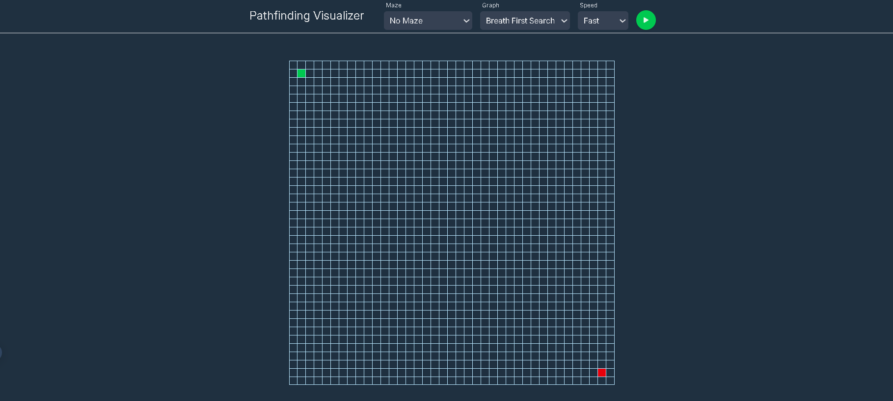

---

## 🔍 Speed Select

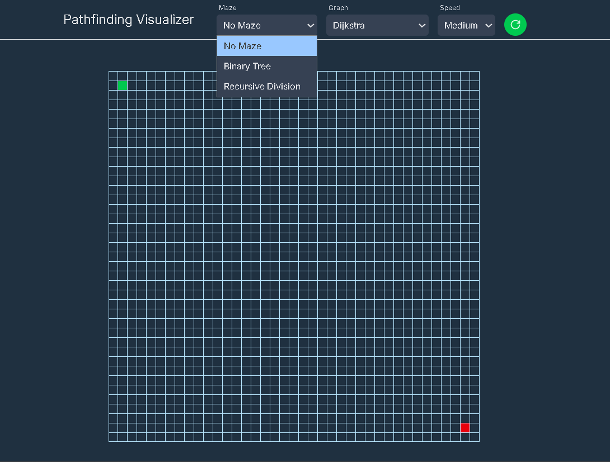

---

## 🔍 Algorithm Select

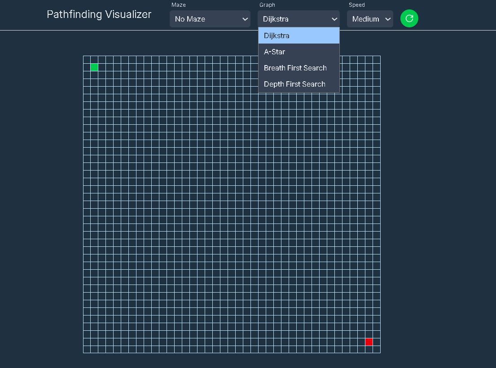

---

## 🔍 Speed Select

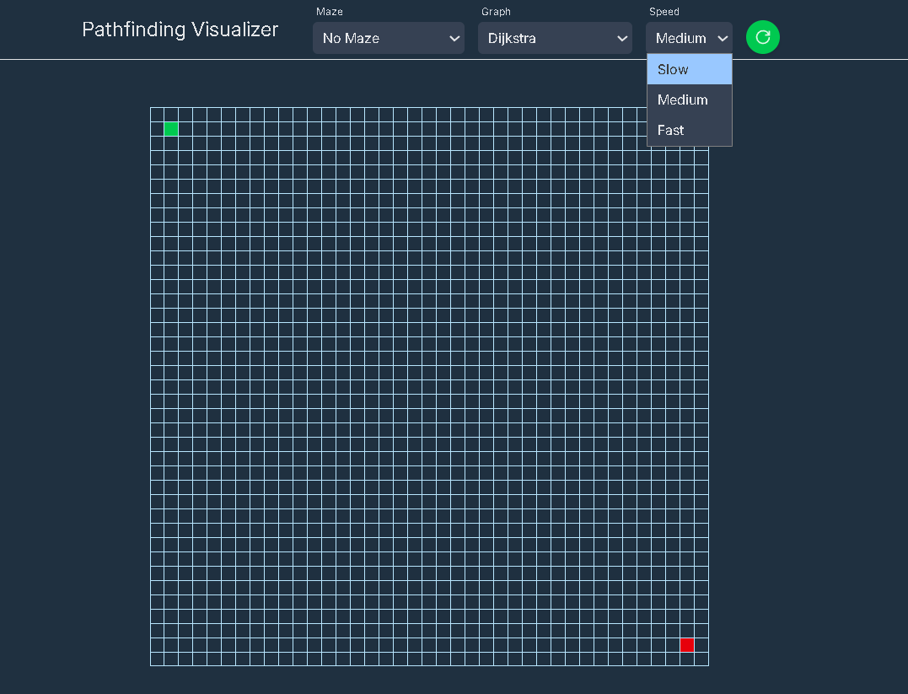

---

## 🧱 Creating Obstacles

**USER CREATED MAZE**

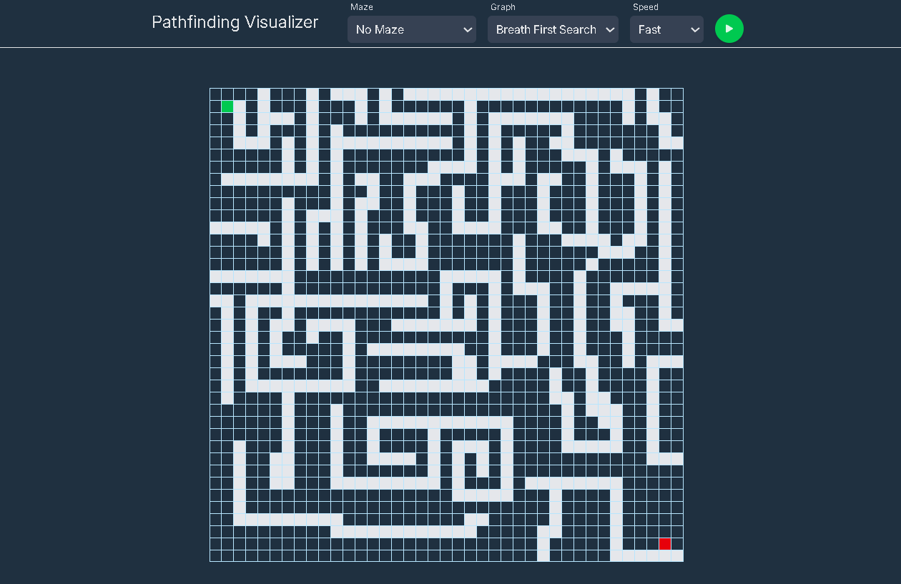

**BINARY TREE MAZE**

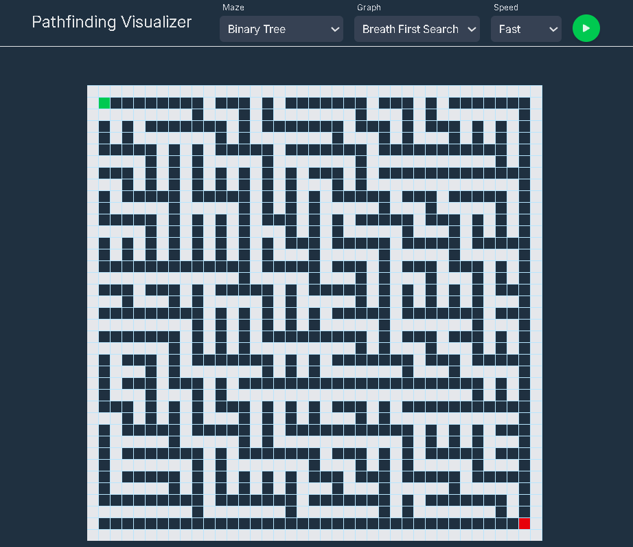

**RECURSIVE DIVSION MAZE**

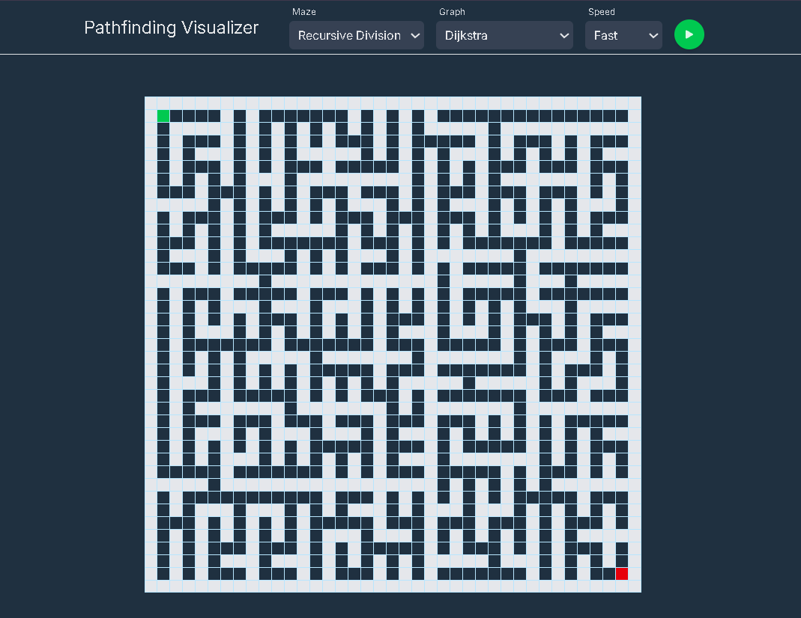
---

## 🎯 Shortest Path Finding


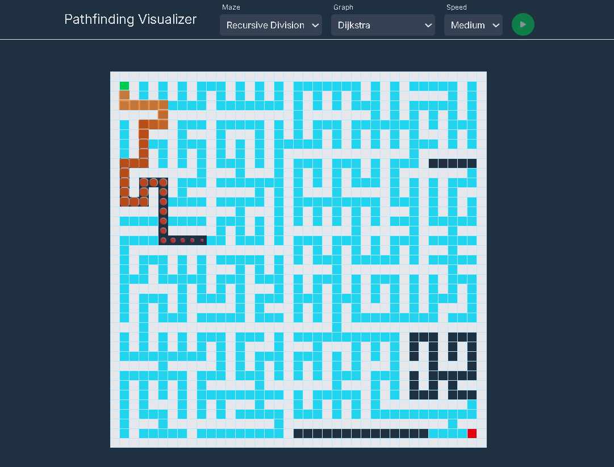

---

## ⚡ Comparing Algorithms

**BFS**

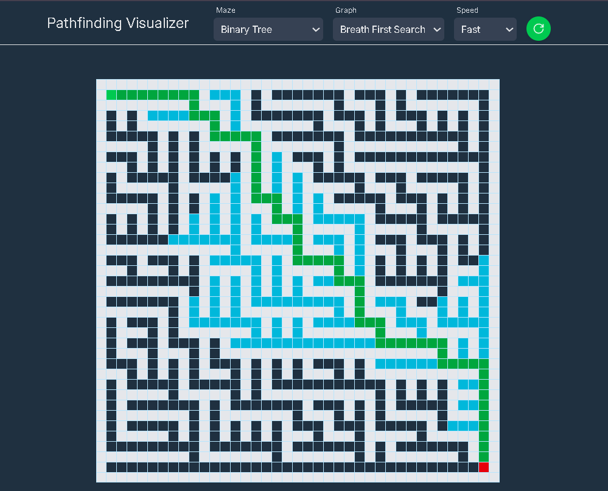

**DFS**

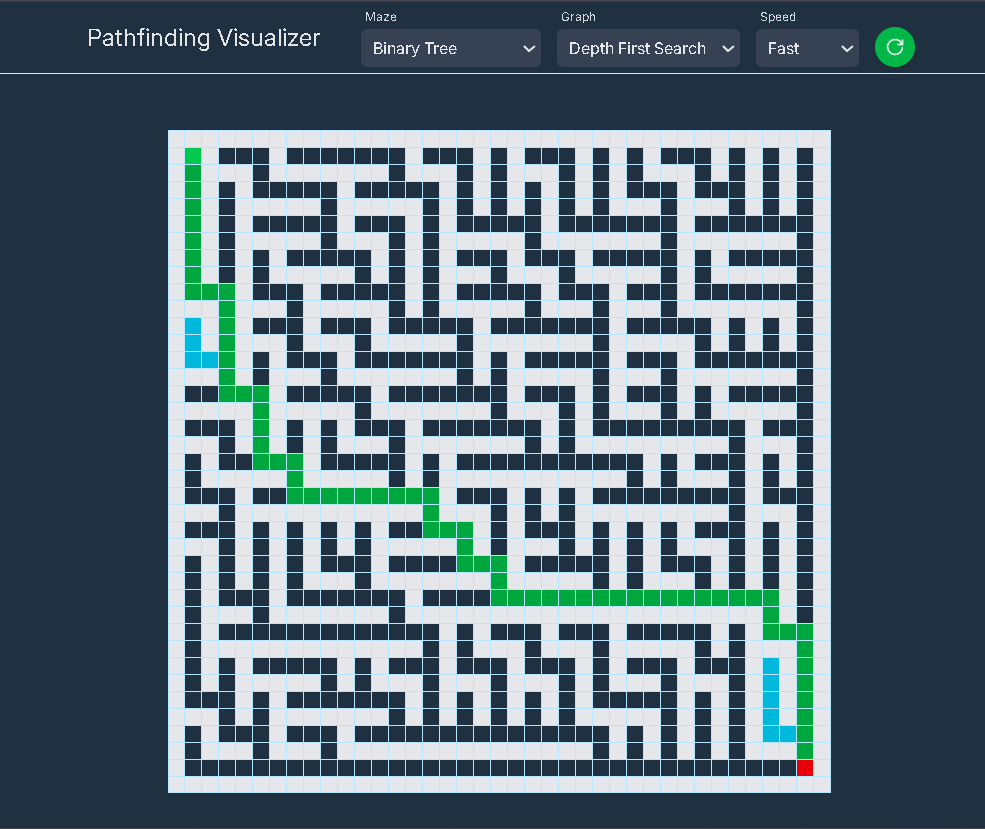

**Dijkstra**

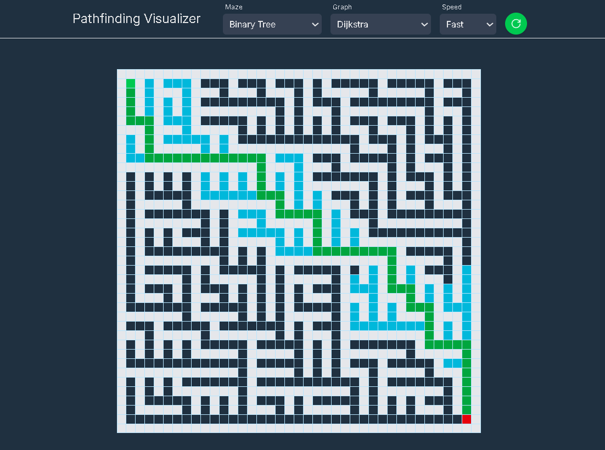

**A-Star**

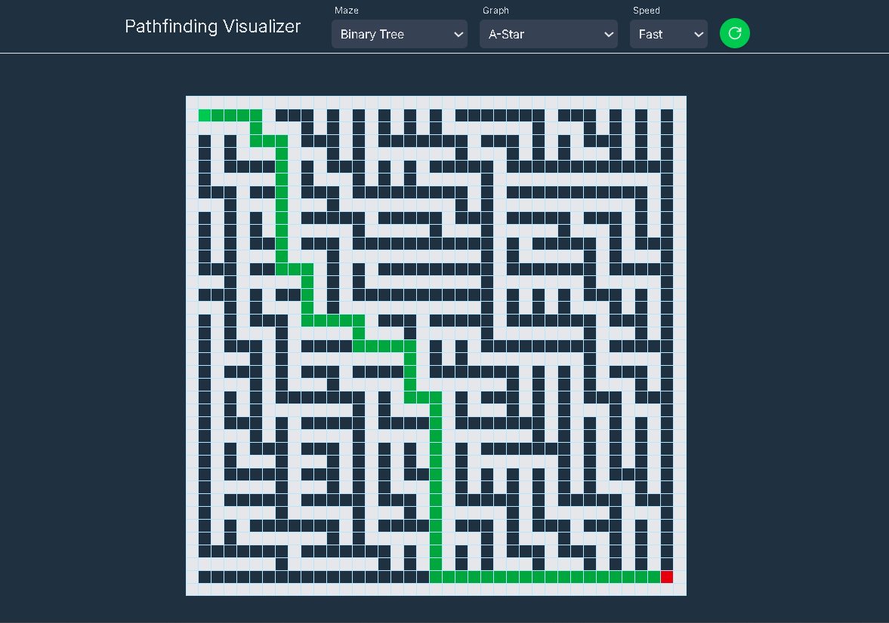

---

# 🛠️ Tech Stack

### Frontend

- React
- TypeScript
- Vite

### Styling

- CSS

### Algorithms

- BFS
- DFS
- Dijkstra
- A*

---

# 🏗️ Project Structure

```text
Pathfinding-Visualizer/
│
├── public/
│   ├── favicon.svg
│   └── icons.svg
│
├── src/
│   │
│   ├── assets/
│   │   ├── hero.png
│   │   ├── react.svg
│   │   └── vite.svg
│   │
│   ├── components/
│   │   ├── Grid.tsx
│   │   ├── Nav.tsx
│   │   ├── PlayButton.tsx
│   │   ├── Select.tsx
│   │   └── Tile.tsx
│   │
│   ├── context/
│   │   ├── PathfindingContext.tsx
│   │   ├── SpeedContext.tsx
│   │   └── TileContext.tsx
│   │
│   ├── hooks/
│   │   ├── usePathfinding.tsx
│   │   ├── useSpeed.tsx
│   │   └── useTile.tsx
│   │
│   ├── lib/
│   │   └── algorithms/
│   │       ├── pathfinding/
│   │       │   ├── bfs.ts
│   │       │   ├── dfs.ts
│   │       │   ├── dijkstra.ts
│   │       │   └── aStar.ts
│   │       │
│   │       └── maze/
│   │           ├── binaryTree.ts
│   │           ├── horizontalDivision.ts
│   │           ├── verticalDivision.ts
│   │           └── recursiveDivision.ts
│   │
│   ├── utils/
│   │   ├── animatePath.ts
│   │   ├── createWall.ts
│   │   ├── destroyWall.ts
│   │   ├── runMazeAlgorithm.ts
│   │   ├── runPathfindingAlgorithm.ts
│   │   └── helpers.ts
│   │
│   ├── App.tsx
│   ├── main.tsx
│   └── index.css
│
├── package.json
├── vite.config.ts
├── tsconfig.json
└── README.md
```

---

# ⚙️ Installation

Clone the repository

```bash
git clone https://github.com/soumilibag/Pathfinding-Visualizer.git
```

Navigate into the project

```bash
cd Pathfinding-Visualizer
```

Install dependencies

```bash
npm install
```

Run locally

```bash
npm run dev
```

Open:

```text
http://localhost:5173
```

---

# 🎮 How To Use

1. Select a start node.
2. Select an end node.
3. Draw walls to create obstacles.
4. Choose a pathfinding algorithm.
5. Start visualization.
6. Watch how the algorithm explores the grid.
7. Observe the final shortest path.

---


# 🚀 Future Improvements

### Planned Features

- 🎯 Bidirectional Search
- 🎯 Greedy Best First Search
- 🎯 Jump Point Search
- 🎯 Weighted Nodes
- 🎯 Drag-and-Drop Start/End Nodes
- 🎯 Mobile Optimization
- 🎯 Dark & Lite Mode
- 🎯 Theme Selection 
- 🎯 Performance Analytics
- 🎯 Adjustable Grid Size (rows & columns)
- 🎯 Real-time Algorithm Comparison

---

# 🌍 Real World Applications

Pathfinding algorithms are used in:

- GPS Navigation Systems
- Robotics
- Video Games
- Network Routing
- AI Agents
- Logistics Optimization
- Autonomous Vehicles

---
# 👨‍💻 Author

**Soumili Bag**

- GitHub: https://github.com/soumilibag
- LinkedIn: https://www.linkedin.com/in/soumili-bag-702080345/

---

Built with ❤️

<div align="center">
</div>